# CIS 566 Homework 4: L-systems

## Stephanie Goldberg - slgold
- Demo: https://slgold95.github.io/hw04-l-systems/
- Moving the 'iterations' or 'branchAngle' slider will cause the L-System to update itself with the new values. Moving the sliders for the petalR,G,B values will not update the L-System unless you click the "recreate" button, which will then update the L-System with the new color values.

## References
- Lecture Slides on L-Systems: https://cis700-procedural-graphics.github.io/files/lsystems_1_31_17.pdf
- L-System Visualization: http://www.kevs3d.co.uk/dev/lsystems/ 

-My L-System Plant:
-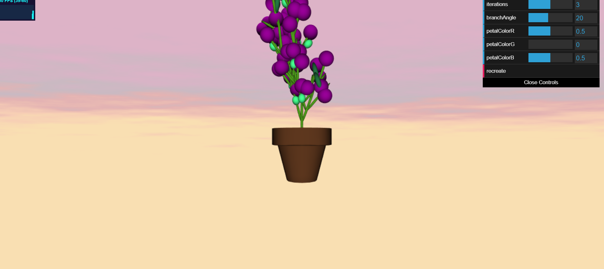
-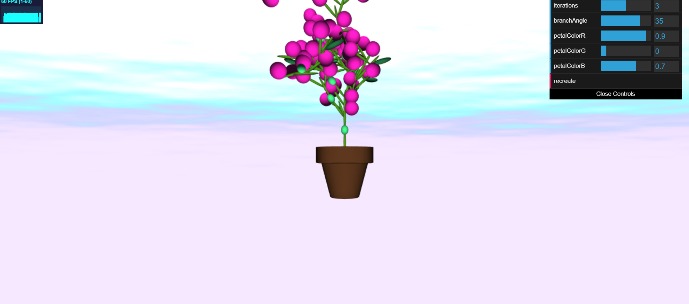
-Inspiration:
-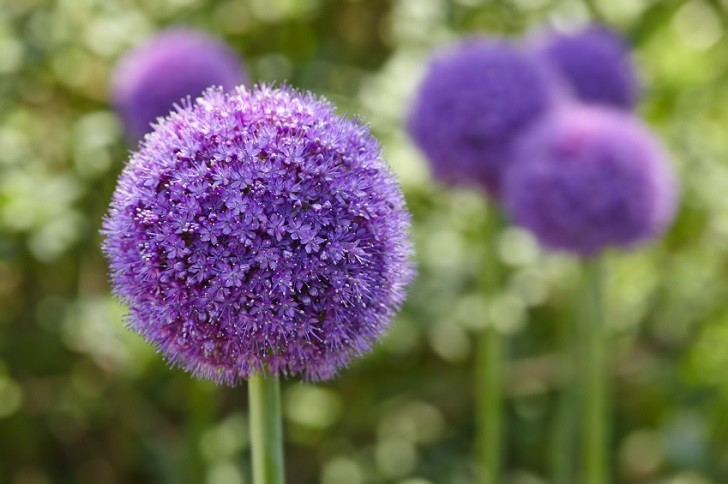

## L-System Classes
- Turtle Class
  - The Turtle class contains information for the position, orientation, quaternion, depth, and rotation amount for the turtle used to create the L-system. Includes rotation and forward movement methods that the turtle uses to store its transforms as it "draws" the L-System.
- ExpansionRules Class
  - The ExpansionRules class contains information for the axiom and grammar map (which is used to map a character to probabilities and functions). These functions are expansion rules, they expand the given character by mapping it to a new string.  
- L-System Class
  - The L-System class contains information for the turtle, turtle stack, expansion rules, and drawing rules. The drawing rules are included in a map that maps the character to a drawing method. The axiom is expanded according to the number of iterations specified for the L-System.
- Image of many iterations and a large rotation angle
- 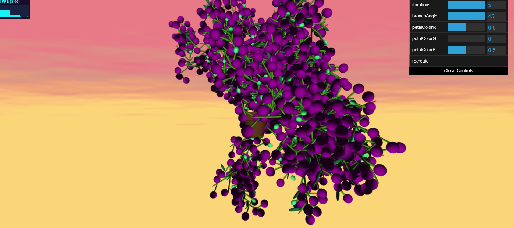
 
## L-System Features
- The position, orientation, and scaling for the instanced geometry (flowers, buds, leaves, and branches) are modified.
- The plant grows in 3D. Randomness is incorporated to determine whether branches rotate on the Y or Z axis.
- The end of branches on the plant can have a purple spherical flower, a light green bud, or a dark green leaf. Each ending geometry has a certain probability of being created. Spherical flowers have a 50% chance, leaves have 25%, and buds have 25%.
- Organic variation in the grammar expansion and drawing operations. There are different probabilities being used with the expansion rules, allowing for variation in the grammar expansion. There is also probabilities incorporated into which elements are drawn at the ends of branches.
- Modeled a plant pot in Maya and exported the .obj file to read in with the obj loader to construct a more cohesive scene for the plant.
- Background fluxuates over time between sunset and daybreak. Shader uses fbm and noise to create clouds.

## GUI Features
- Tunable slider for the number of iterations the L-System runs through
- 1 iteration:
- 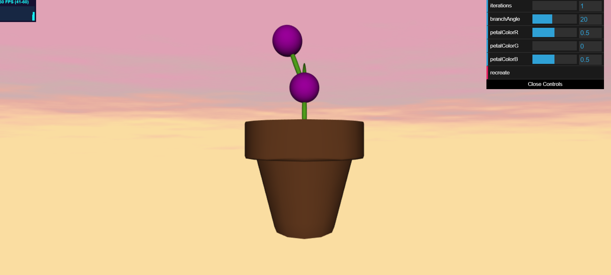
- 2 iterations:
- 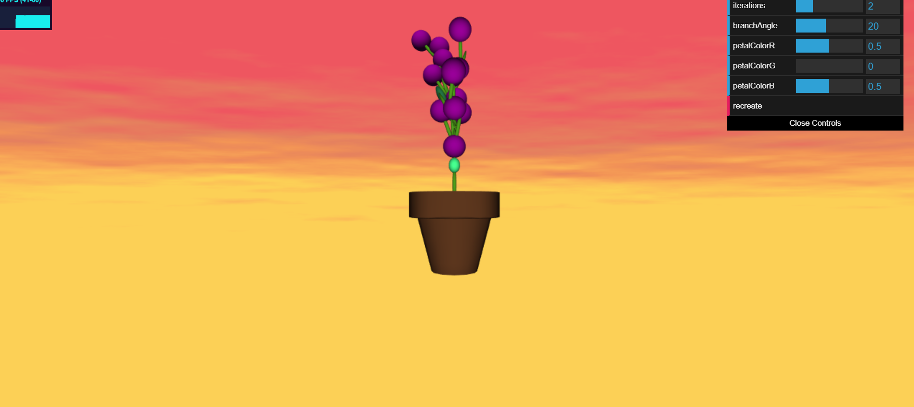
- 3 iterations:
- 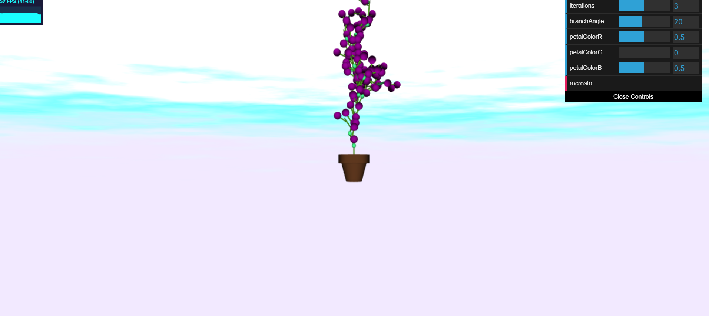
- 4 iterations:
- 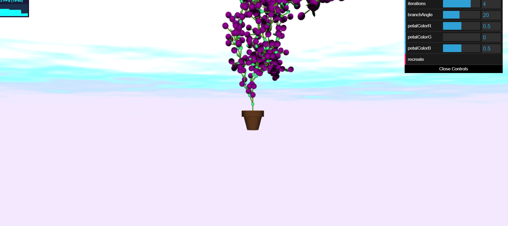
- Tunable slider for the rotation angle of the branches
- Angle set to 0:
- 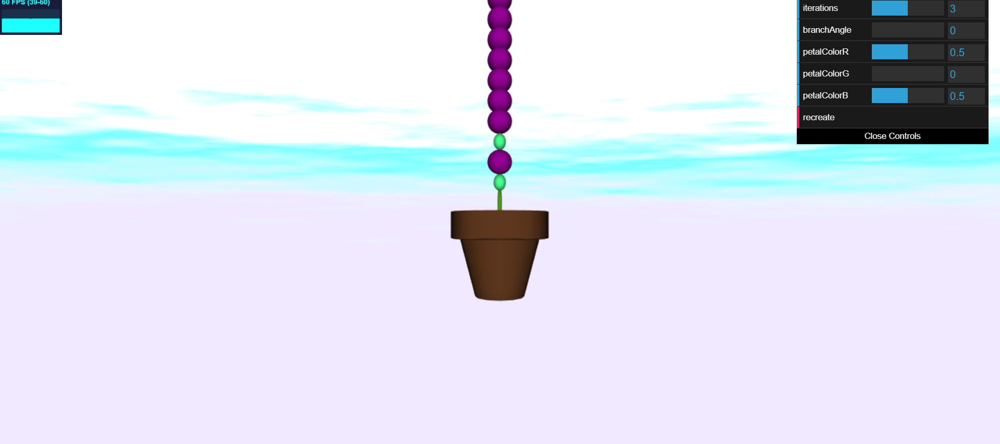
- Angle set to 35:
- 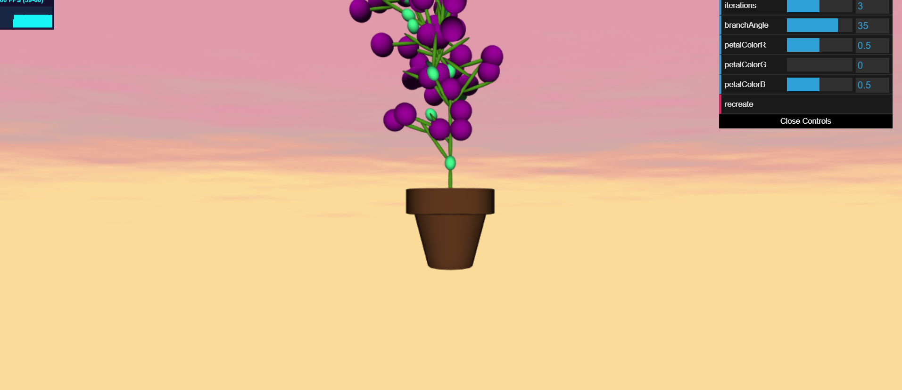
- Tunable sliders to modify the RGB channels of the spherical flower colors
- Red Flowers:
- 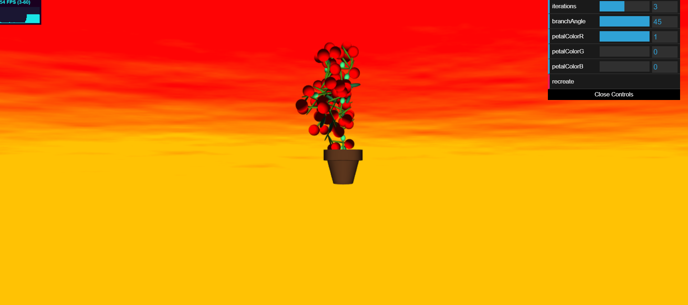
- Green Flowers:
- 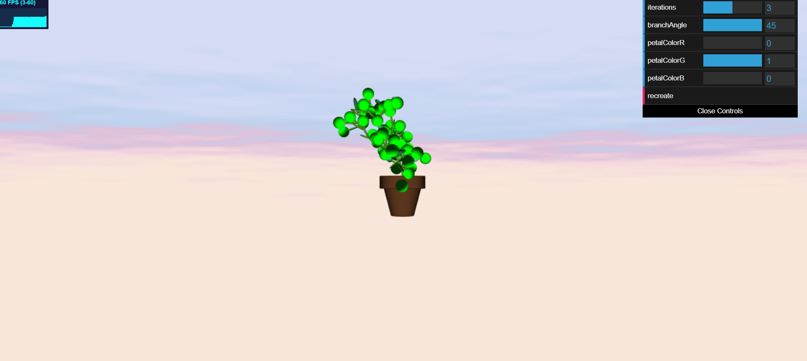
- Blue Flowers:
- 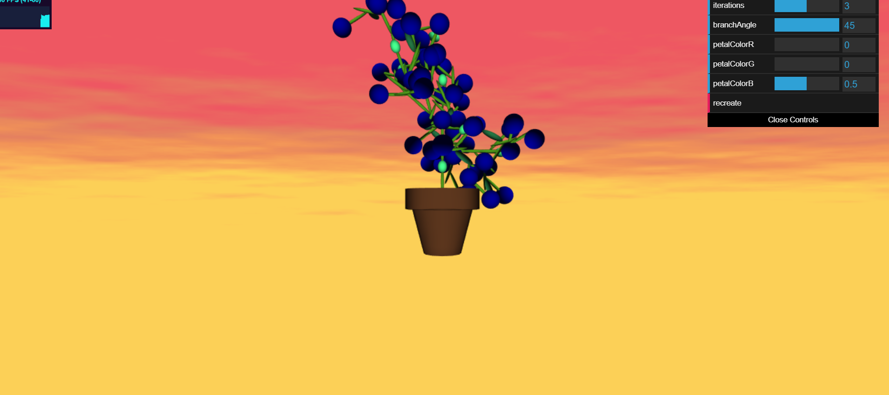
- Pink Flowers:
- 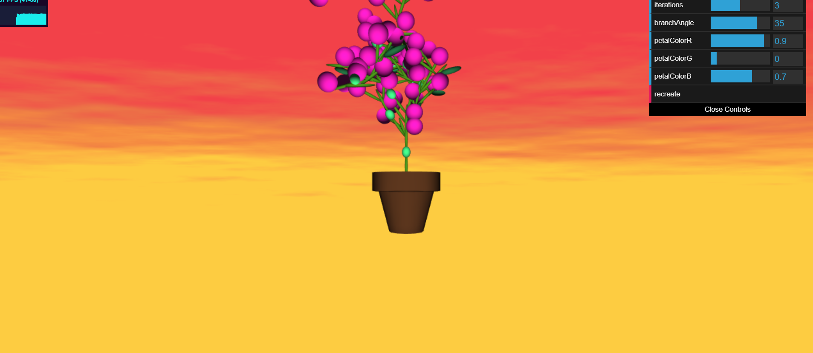

